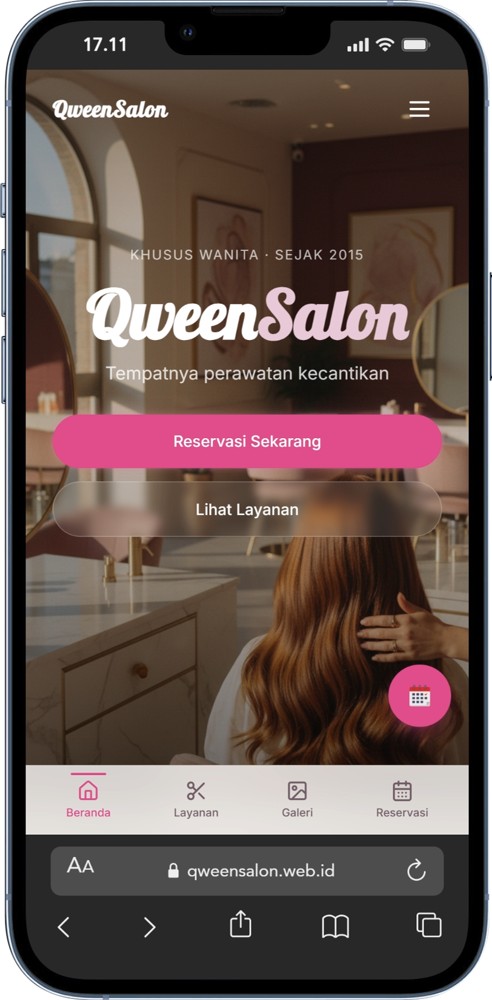
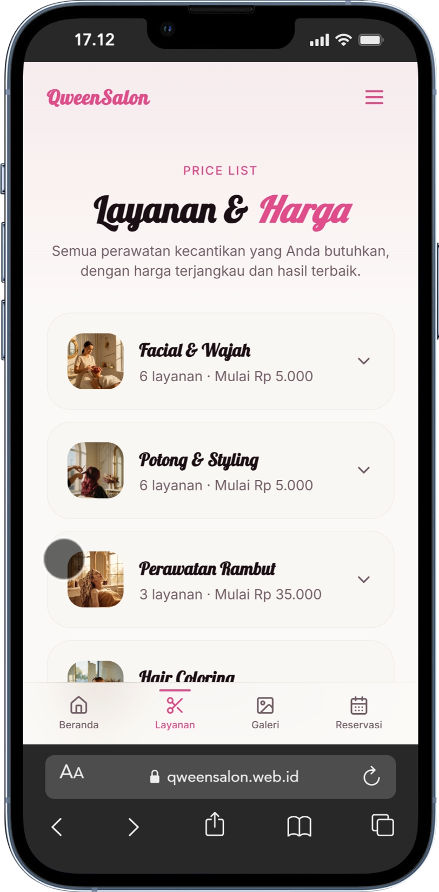
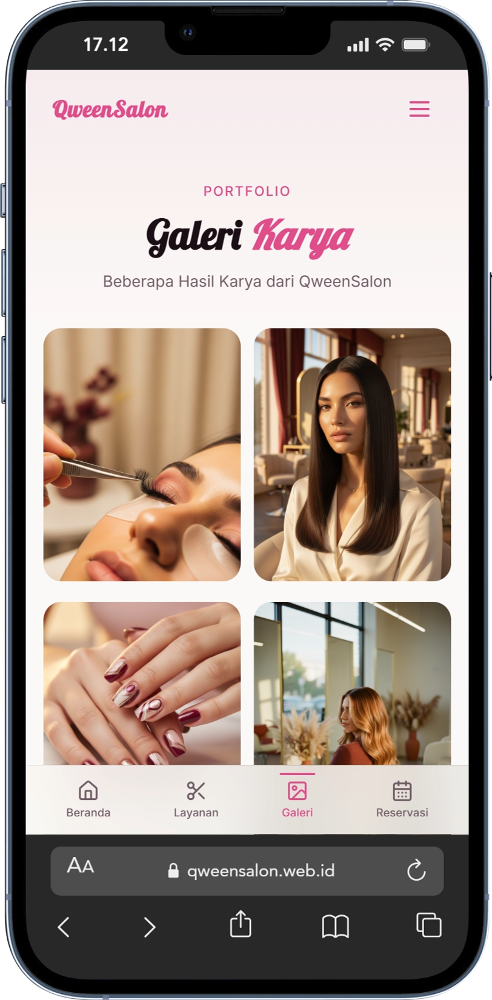

# Qween SalonWeb

Website dan aplikasi Android untuk QweenSalon — salon kecantikan di Yogyakarta dengan cabang Sonopakis dan Notoyudan.

## Live Demo

🌐 **Website**: [www.qweensalon.web.id](https://www.qweensalon.web.id)

## Screenshots

<p align="center">
  
  
</p>
<p align="center">
  
  
</p>

## Fitur

- **Beranda** — Hero section, promo diskon, preview layanan, filosofi, tim, kontak
- **Layanan** — Daftar layanan salon dengan harga (Facial, Potong, Perawatan, Coloring, Smoothing, Eyelash, Nail Art)
- **Galeri** — Showcase hasil karya dengan upload dari admin
- **Reservasi** — Booking via WhatsApp dengan form lengkap (nama, HP, layanan, cabang, tanggal, jam)
- **Promo** — Tombol "Gunakan Promo" mengarah ke reservasi dengan info diskon otomatis di pesan WhatsApp
- **Settings** (Android only) — Kelola profil, diskon, dan galeri (tersembunyi di web)
- **PWA-ready** — Responsive untuk mobile dan desktop

## Tech Stack

- **Frontend**: React 18, React Router DOM 6, Framer Motion
- **Styling**: Tailwind CSS, Radix UI, Lucide Icons
- **Backend**: Supabase (PostgreSQL, Storage)
- **Build**: Vite 6
- **Mobile**: Capacitor (Android)
- **Deploy**: GitHub Pages (auto-deploy via GitHub Actions)

## Struktur Project

```
src/
├── components/
│   ├── home/          # HeroSection, PromoSection, ServicesPreview, dll
│   ├── navigation/    # GlassHeader, BottomNav
│   ├── services/      # ServiceCategory
│   ├── settings/      # DiscountForm
│   ├── booking/       # BookingSteps
│   └── ui/            # Radix UI components
├── pages/             # Home, Services, Gallery, Booking
├── lib/               # SettingsContext, AuthContext, Supabase, utils
├── api/               # base44Client (legacy)
└── main.jsx
```

## Getting Started

### Prerequisites

- Node.js 18+
- npm

### Install & Run

```bash
git clone https://github.com/elproject-development/qweensalon.git
cd qweensalon
npm install
npm run dev
```

### Environment Variables

Buat file `.env.local`:

```
VITE_SUPABASE_URL=your_supabase_url
VITE_SUPABASE_ANON_KEY=your_supabase_anon_key
```

## Scripts

| Command | Description |
|---|---|
| `npm run dev` | Jalankan dev server |
| `npm run build` | Build production ke `dist/` |
| `npm run preview` | Preview hasil build |
| `npm run deploy` | Deploy ke GitHub Pages |
| `npm run android:build` | Build web + sync ke Android |
| `npm run cap:sync` | Sync web assets ke Android |
| `npm run cap:open` | Buka Android Studio |

## Android Build

### Debug APK

```bash
npm run android:build
cd android && ./gradlew assembleDebug
```

File: `android/app/build/outputs/apk/debug/app-debug.apk`

### Release APK (Signed)

```bash
npm run android:build
cd android && ./gradlew assembleRelease
```

File: `android/app/build/outputs/apk/release/app-release.apk`

> ⚠️ Keystore file (`qweensalon-release.jks`) tidak di-commit ke repo. Simpan backup di tempat aman.

### Install ke Device

```bash
adb install -r "android/app/build/outputs/apk/release/app-release.apk"
```

## Deployment

### GitHub Pages (Auto-deploy)

Setiap push ke branch `main`, GitHub Actions otomatis build dan deploy ke `www.qweensalon.web.id`.

### Manual Deploy

```bash
npm run deploy
```

## Cabang QweenSalon

| Cabang | Alamat |
|---|---|
| Sonopakis | Jl. Sonopakis No.136, Kasihan, Bantul |
| Notoyudan | Jl. Notoyudan No.979, Yogyakarta |

## License

© 2015–2026 QweenSalon. All rights reserved.
